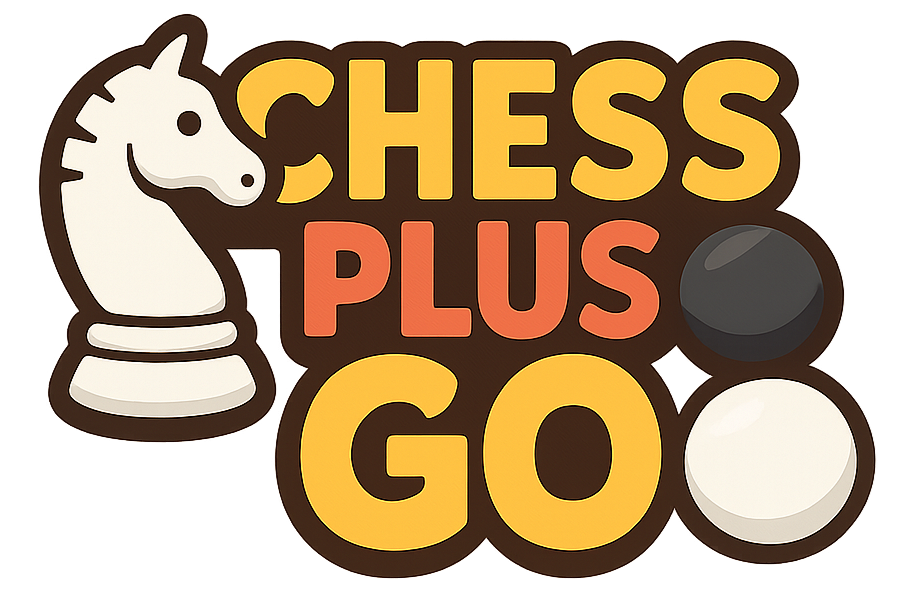

# Chess-Go

Chess-Go is a small browser-based, single-player chess demo built with plain ES modules and a few lightweight libraries. It renders a 3D chess board and pieces using Three.js and loads GLTF models for each piece. The game implements basic chess movement rules and a minimal turn-based opponent that automatically makes the first valid move it finds.

This repository is intentionally minimal and dependency-free (no build step) — everything runs in the browser using CDN-hosted libraries and local GLTF assets.

---

## What it uses

- Three.js (modules & GLTFLoader) — 3D rendering and model loading (imported via the import map in `index.html`).
- Vue 3 (global build) — tiny UI layer used for the loading / UI controls.
- GSAP — animations for piece / tile transitions.
- Tailwind (browser build) — quick utility CSS used in `index.html`.
- GLTF assets (under `gltf/`) — 3D models for pawn, rook, knight, bishop, queen, king.

All external libraries are included via CDN in `index.html`, so you do not need to run a bundler.

---

## Project structure

- `index.html` — the single page that bootstraps the app and import maps for modules and CDNs.
- `main.js` — Vue app that loads models then starts the game.
- `js/`
  - `Game.js` — high-level game loop, Three.js renderer/camera, event handling (mouse/touch), turn logic.
  - `Level.js` — board representation, piece placement, move generation and validation, piece movement.
  - `Piece.js` — wrapper for a GLTF piece model, material setup, piece metadata (type/color, rank/file).
  - `Tile.js` — individual board tile mesh with selection/mark/reset helpers.
  - `ModelLoader.js` — loads and caches GLTF models placed in `gltf/{piece}/scene.gltf`.
  - `Material.js` — (small helpers) tile materials.
- `gltf/` — directory with the 3D models used by pieces (one folder per piece type).
- `png/` and `favicon.ico` — small assets.

---

## How it works (high-level)

1. `index.html` loads `main.js` as an ES module.
2. `main.js` instantiates a `Game` and uses `ModelLoader` to preload the GLTF models for each piece type.
3. When loading completes, `Game.loadLevel('classic')` constructs a `Level` instance:
   - `Level` reads a 2D array description of the board, creates `Tile` objects for each square and `Piece` objects when a piece letter is present.
   - Piece identifiers are single letters (k/q/r/b/n/p). The code maps letters to piece types. In this project the code treats lowercase letters as `white` and uppercase letters as `black`.
4. `Game` sets up a Three.js `OrthographicCamera`, lights, and a WebGL renderer. It mounts the renderer to the document body and starts an animation loop.
5. Mouse/touch events are handled in `Game`:
   - Moving the cursor casts a ray into the scene and highlights tiles/pieces.
   - Click (or touch) + drag picks up a piece and moves it; releasing attempts a move.
   - `Level.getValidMoves()` computes legal moves for a piece (basic movement rules + simple check detection).
6. After the player moves, a simple opponent loop searches the first legal move for the other color and plays it. If no moves remain, the level increments (see `Level` levels mapping).

Note: the chess rules implemented cover typical piece movement and some checks against moving into check; this is a minimal ruleset, not a full FIDE-complete engine (no en passant, castling, promotions are limited).

---

## Controls / UI

- Mouse move: highlight tiles and change cursor when a piece is hoverable.
- Mouse down on your piece: pick it up (or click/tap).
- Drag + release on a valid tile: move the piece.
- "Restart" button (top-left once load completes): reloads the current level.

---

## Run locally

Because this project uses ES module imports and fetches GLTF assets over HTTP, you should serve the folder from a local HTTP server rather than opening `index.html` with the `file://` protocol.

From the project root open a terminal and run one of these (choose what you have installed):

- Python 3 (very common):
  - POSIX / Windows:
    - `cd chess-go`
    - `python -m http.server 8000`
  - Then open: `http://localhost:8000/index.html`

- Node (using `serve`, if you have it):
  - `cd chess-go`
  - `npx serve .` (or install `serve` globally and run `serve .`)
  - Open the URL that `serve` prints (usually `http://localhost:5000`)

- VS Code: install the Live Server extension and "Open with Live Server" on the `index.html`.

Notes:
- You need internet access for the CDN-hosted libraries (Vue, Three, GSAP, Tailwind). If you want to run offline, vendor the libraries locally and update `index.html` to reference local copies.
- The GLTF models are loaded from `gltf/{piece}/scene.gltf`, so the directory must be accessible at the same host root as `index.html` (serving the `chess-go` folder as root satisfies this).

---

## Extending the project

- Add/replace models:
  - Place a GLTF model at `gltf/{piece}/scene.gltf` (e.g., `gltf/pawn/scene.gltf`) and ensure textures/bin files are alongside it.
  - The `ModelLoader` expects exact folder names used in `main.js` (`pawn`, `rook`, `knight`, `bishop`, `queen`, `king`).
- Add levels:
  - Edit `js/Level.js` and add a new key to the `levels` object. The board is a 2D array of identifiers (use `-` for empty).
- Improve AI:
  - The current "opponent" simply picks the first legal move. Replace that section in `Game.handleCursorUp()` with a stronger move selection algorithm.
- Rules:
  - Implement promotion, en passant, castling if you need more accurate chess behavior.

---

## Troubleshooting

- Nothing appears / blank screen:
  - Check the browser console for network errors (404 for `scene.gltf` or other assets).
  - Make sure you are serving over HTTP (not `file://`) and that the server root is `chess-go`.
- Errors like "cannot use import statement outside a module":
  - Ensure `index.html` is loaded as a page served from an HTTP server. Also modern browsers are required (ES module support).
- Models invisible or transparent:
  - Pieces are initially faded in by GSAP; ensure animations completed. Also check console for model parsing errors.

---

## License & assets

- The repo itself contains small demo code. Check individual GLTF model `license.txt` files in each `gltf/*` folder for model-specific licenses and attributions.

---

If you'd like, I can:
- Add a short CONTRIBUTING or DEVELOPMENT section with common commands,
- Add a tiny dev server script (package.json) to simplify serving on Node,
- Or update `index.html` to use relative imports instead of absolute root paths (to make opening via `file://` easier) — tell me which you'd prefer.
